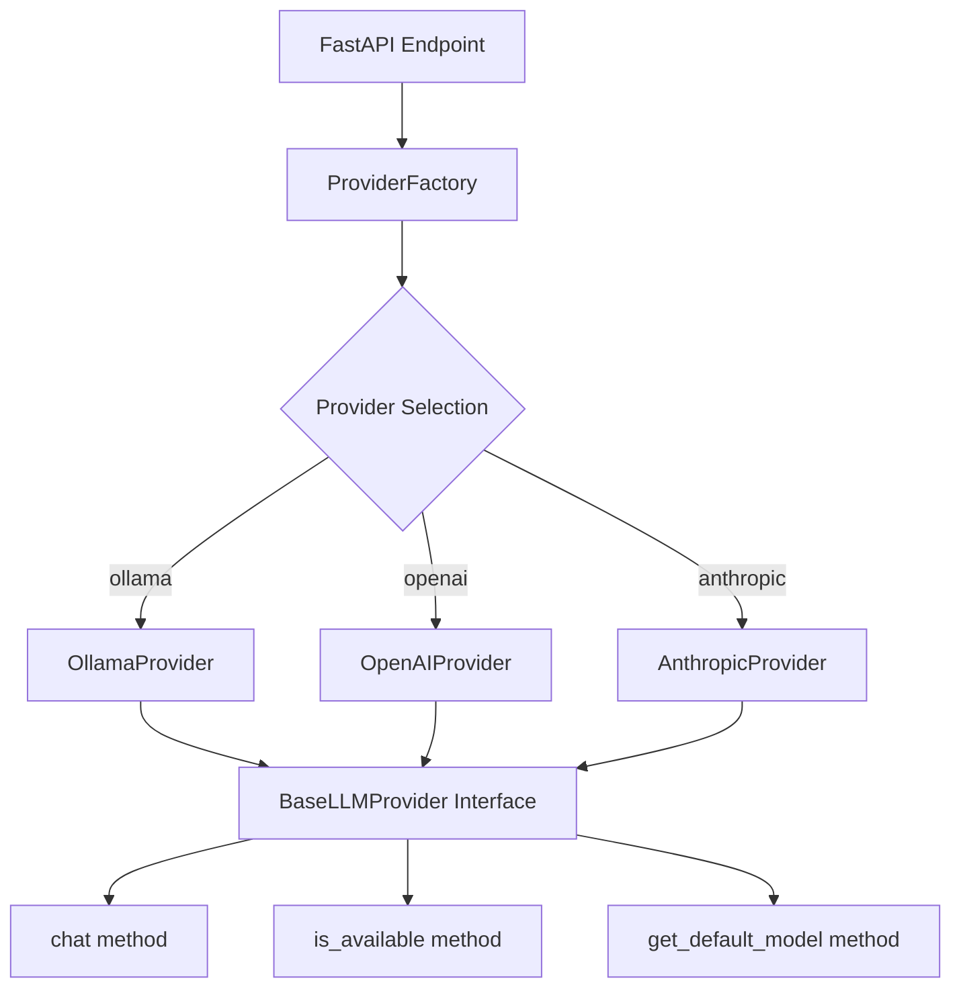
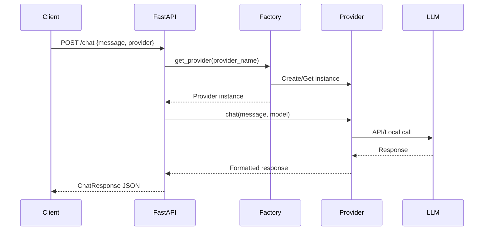

# Chatbot Service Implementation Walkthrough

## Overview

Successfully implemented a production-ready chatbot service in Python with the following key features:

- ✅ **Modular provider architecture** supporting Ollama, OpenAI, and Anthropic
- ✅ **FastAPI REST API** with `/chat` and `/health` endpoints
- ✅ **Docker containerization** with Docker Compose orchestration
- ✅ **Comprehensive documentation** including Gherkin specifications
- ✅ **Production-ready** with security, logging, and health checks

## What Was Built

### Core Files Created

#### 1. Provider Architecture (`providers/`)

**[base.py](file:///c:/AI_projects/chatbot-project/providers/base.py)**
- Abstract base class defining the provider interface
- Methods: `chat()`, `is_available()`, `get_default_model()`
- Ensures consistent behavior across all providers

**[ollama_provider.py](file:///c:/AI_projects/chatbot-project/providers/ollama_provider.py)**
- Ollama implementation using `llama3` as default model
- Connects to local Ollama service at `http://localhost:11434`
- Supports all Ollama models (llama3, mistral, codellama, etc.)

**[openai_provider.py](file:///c:/AI_projects/chatbot-project/providers/openai_provider.py)**
- OpenAI GPT integration (optional dependency)
- Supports GPT-4, GPT-3.5-turbo, and other OpenAI models
- Requires `OPENAI_API_KEY` environment variable

**[anthropic_provider.py](file:///c:/AI_projects/chatbot-project/providers/anthropic_provider.py)**
- Anthropic Claude integration (optional dependency)
- Supports Claude 3 models
- Requires `ANTHROPIC_API_KEY` environment variable

**[\_\_init\_\_.py](file:///c:/AI_projects/chatbot-project/providers/__init__.py)**
- Provider factory implementing the factory pattern
- Singleton instances for each provider
- Graceful handling of missing optional dependencies

#### 2. FastAPI Application

**[chatbot.py](file:///c:/AI_projects/chatbot-project/chatbot.py)**

Key features:
- **POST /chat** - Main chat endpoint with provider selection
- **GET /health** - Health check showing provider availability
- **GET /** - API information
- CORS middleware for cross-origin requests
- Comprehensive error handling and logging
- Pydantic models for type-safe request/response

#### 3. Docker Configuration

**[Dockerfile](file:///c:/AI_projects/chatbot-project/Dockerfile)**
- Python 3.11 slim base image
- Non-root user for security
- Health check built-in
- Optimized layer caching

**[docker-compose.yml](file:///c:/AI_projects/chatbot-project/docker-compose.yml)**
- Two services: `ollama` and `chatbot`
- Volume persistence for Ollama models
- Network connectivity between services
- Optional GPU support (commented out)

**[.dockerignore](file:///c:/AI_projects/chatbot-project/.dockerignore)**
- Excludes unnecessary files from Docker build

#### 4. Dependencies & Configuration

**[requirements.txt](file:///c:/AI_projects/chatbot-project/requirements.txt)**
- Core: FastAPI, Uvicorn, Pydantic, python-dotenv
- Ollama provider (required)
- OpenAI and Anthropic (optional, commented)

**[.env.example](file:///c:/AI_projects/chatbot-project/.env.example)**
- Template for environment variables
- Ollama, OpenAI, and Anthropic configuration

#### 5. Documentation

**[README.md](file:///c:/AI_projects/chatbot-project/README.md)**
- Comprehensive setup instructions
- API documentation with examples
- Provider configuration guides
- Docker commands reference
- Troubleshooting section

**[specs/chatbot.feature](file:///c:/AI_projects/chatbot-project/specs/chatbot.feature)**
- Gherkin BDD specifications
- 12 scenarios covering all functionality
- Provider switching, error handling, validation

## Architecture Highlights

### Modular Provider System

The service uses a **factory pattern** for maximum flexibility:



### Request Flow



## Verification Steps

### Prerequisites Check

> [!IMPORTANT]
> Before testing, ensure you have:
> - ✅ Python 3.11+ installed
> - ✅ Docker and Docker Compose installed (for container testing)
> - ✅ Ollama installed and running (for local testing)

### Step 1: Test Local Installation

Install dependencies (already completed):

```bash
pip install -r requirements.txt
```

### Step 2: Verify Ollama is Running

Check if Ollama is accessible:

```bash
# Start Ollama (if not running)
ollama serve

# In another terminal, pull llama3 model
ollama pull llama3

# Verify models are available
ollama list
```

### Step 3: Start the API Server

```bash
# From the project directory
python chatbot.py
```

Expected output:
```
INFO:     Started server process
INFO:     Waiting for application startup.
INFO:     Application startup complete.
INFO:     Uvicorn running on http://0.0.0.0:8000
```

### Step 4: Test the Health Endpoint

In a new terminal:

```bash
curl http://localhost:8000/health
```

Expected response:
```json
{
  "status": "healthy",
  "providers": {
    "ollama": true,
    "openai": false,
    "anthropic": false
  }
}
```

### Step 5: Test the Chat Endpoint

**Simple chat request:**

```bash
curl -X POST http://localhost:8000/chat \
  -H "Content-Type: application/json" \
  -d "{\"message\": \"Hello, how are you?\"}"
```

**With specific model:**

```bash
curl -X POST http://localhost:8000/chat \
  -H "Content-Type: application/json" \
  -d "{\"message\": \"What is Python?\", \"provider\": \"ollama\", \"model\": \"llama3\"}"
```

Expected response:
```json
{
  "response": "I'm doing well, thank you! How can I assist you today?",
  "provider": "ollama",
  "model": "llama3"
}
```

### Step 6: Test Interactive API Docs

Visit in your browser:
- **Swagger UI**: http://localhost:8000/docs
- **ReDoc**: http://localhost:8000/redoc

Try the "Try it out" feature in Swagger UI to interactively test the endpoints.

### Step 7: Docker Testing

**Build and start containers:**

```bash
docker-compose up -d
```

**Pull llama3 model in Ollama container:**

```bash
docker exec -it ollama ollama pull llama3
```

**Test the containerized API:**

```bash
curl -X POST http://localhost:8000/chat \
  -H "Content-Type: application/json" \
  -d "{\"message\": \"Hello from Docker!\"}"
```

**View logs:**

```bash
docker-compose logs -f
```

**Stop containers:**

```bash
docker-compose down
```

## Provider Switching Demo

The modular architecture allows switching providers without changing the API:

### Using Ollama (Default)

```bash
curl -X POST http://localhost:8000/chat \
  -H "Content-Type: application/json" \
  -d '{"message": "Explain AI", "provider": "ollama"}'
```

### Using OpenAI (if configured)

```bash
# First, install OpenAI package and set API key
pip install openai
export OPENAI_API_KEY=sk-...

curl -X POST http://localhost:8000/chat \
  -H "Content-Type: application/json" \
  -d '{"message": "Explain AI", "provider": "openai", "model": "gpt-4"}'
```

### Using Anthropic (if configured)

```bash
# First, install Anthropic package and set API key
pip install anthropic
export ANTHROPIC_API_KEY=sk-ant-...

curl -X POST http://localhost:8000/chat \
  -H "Content-Type: application/json" \
  -d '{"message": "Explain AI", "provider": "anthropic"}'
```

## Key Design Decisions

### 1. Factory Pattern

**Why**: Allows easy addition of new providers without modifying existing code. Supports dependency injection and testing.

### 2. Async/Await

**Why**: FastAPI is async-first. All provider methods use `async def` for better performance and concurrency.

### 3. Optional Dependencies

**Why**: Users can install only the providers they need. OpenAI and Anthropic are optional, reducing initial setup complexity.

### 4. Environment-Based Configuration

**Why**: Separates configuration from code. Supports different environments (dev, staging, prod) without code changes.

### 5. Docker Compose

**Why**: Simplifies deployment by bundling Ollama and the chatbot service together. Ensures consistent environment.

## File Summary

| File | Lines | Purpose |
|------|-------|---------|
| [chatbot.py](file:///c:/AI_projects/chatbot-project/chatbot.py) | 162 | Main FastAPI application |
| [providers/base.py](file:///c:/AI_projects/chatbot-project/providers/base.py) | 40 | Abstract base class |
| [providers/ollama_provider.py](file:///c:/AI_projects/chatbot-project/providers/ollama_provider.py) | 76 | Ollama implementation |
| [providers/openai_provider.py](file:///c:/AI_projects/chatbot-project/providers/openai_provider.py) | 90 | OpenAI implementation |
| [providers/anthropic_provider.py](file:///c:/AI_projects/chatbot-project/providers/anthropic_provider.py) | 95 | Anthropic implementation |
| [providers/\_\_init\_\_.py](file:///c:/AI_projects/chatbot-project/providers/__init__.py) | 101 | Provider factory |
| [Dockerfile](file:///c:/AI_projects/chatbot-project/Dockerfile) | 33 | Container definition |
| [docker-compose.yml](file:///c:/AI_projects/chatbot-project/docker-compose.yml) | 32 | Service orchestration |
| [requirements.txt](file:///c:/AI_projects/chatbot-project/requirements.txt) | 11 | Python dependencies |
| [.env.example](file:///c:/AI_projects/chatbot-project/.env.example) | 12 | Config template |
| [specs/chatbot.feature](file:///c:/AI_projects/chatbot-project/specs/chatbot.feature) | 156 | Gherkin specifications |
| [README.md](file:///c:/AI_projects/chatbot-project/README.md) | 600+ | Documentation |

**Total**: ~1,400 lines of production-ready code and documentation

## Next Steps

### Recommended Actions

1. **Test Locally**: Follow verification steps above to test with Ollama
2. **Try Docker**: Build and run the containerized version
3. **Add Providers**: Install OpenAI or Anthropic packages if needed
4. **Customize**: Modify default models, add custom parameters
5. **Deploy**: Use Docker Compose for production deployment

### Future Enhancements

- [ ] Add authentication (API keys, JWT)
- [ ] Implement rate limiting
- [ ] Add conversation history/context
- [ ] Create a simple web UI
- [ ] Add streaming responses
- [ ] Implement caching for responses
- [ ] Add automated tests (pytest)
- [ ] Set up CI/CD pipeline
- [ ] Add metrics and monitoring
- [ ] Create Kubernetes manifests

## Troubleshooting

### Common Issues

> [!WARNING]
> **"Ollama chat error: Connection refused"**
> 
> Solution: Start Ollama with `ollama serve`

> [!WARNING]
> **"model 'llama3' not found"**
> 
> Solution: Pull the model with `ollama pull llama3`

> [!WARNING]
> **"ModuleNotFoundError: No module named 'providers'"**
> 
> Solution: Ensure you're running from the project root directory

> [!TIP]
> Check the [README.md](file:///c:/AI_projects/chatbot-project/README.md) for comprehensive troubleshooting guidance.

## Conclusion

The chatbot service is fully implemented with:

✅ **Modular architecture** - Easy to extend with new providers  
✅ **Production-ready** - Docker, logging, health checks, security  
✅ **Well-documented** - README, Gherkin specs, inline comments  
✅ **Flexible** - Switch between Ollama, OpenAI, Claude seamlessly  
✅ **Type-safe** - Pydantic models for validation  
✅ **RESTful API** - FastAPI with auto-generated docs  

The service is ready for local development, Docker deployment, or cloud hosting.
